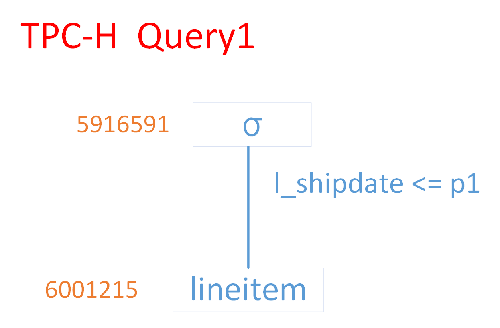
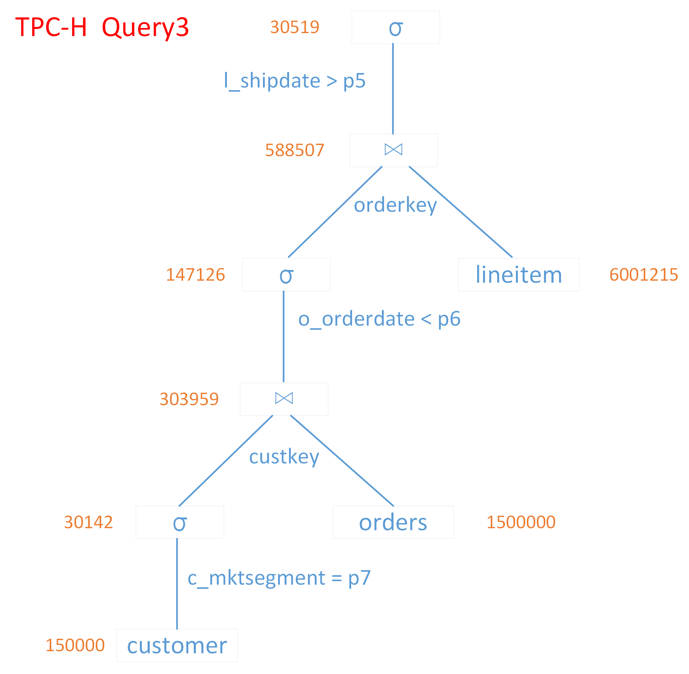

<a href="https://github.com/daseECNU/Touchstone/blob/master/running%20examples/input/README-en.md">English Version</a>

Touchstone有两个输入数据文件，分别包含了数据库Schema信息（含数据特征信息）和基数约束信息。针对TPC-H和SSB（Star Schema Benchmark）的负载，我们在此给出了论文实验中的部分输入，下面会根据这些示例输入来介绍输入数据的具体格式。

### 关于输入数据的说明

#### 数据库Schema：

T[table\_name; table\_size; column\_name, data\_type; ...; P(primary\_key); F(foreign\_key, referenced\_table.referenced\_primary_key); ...]  

示例：  
T[PARTSUPP; 8000000; PS\_PARTKEY, INTEGER; PS\_SUPPKEY, INTEGER; PS\_AVAILQTY, INTEGER; PS\_SUPPLYCOST, DECIMAL; PS\_COMMENT, VARCHAR; P(PS\_PARTKEY, PS\_SUPPKEY); F(PS\_PARTKEY, PART.P\_PARTKEY); F(PS\_SUPPKEY, SUPPLIER.S\_SUPPKEY)]

#### 基本数据特征：

**Integer:**  
D[table\_name.column\_name; null\_ratio; cardinality; min\_value; max\_value]  
示例：  
D[T1.c1; 0.05; 100; 1; 9999]

**Real & Decimal：**  
D[table\_name.column\_name; null\_ratio; min\_value; max\_value]  
示例：  
D[T1.c2; 0; 0.1; 1000.5]

**Varchar：**  
D[table\_name.column\_name; null\_ratio; avg\_length; max\_length]  
示例：  
D[T1.c3; 0; 123.5; 199]

**Bool:**  
D[table\_name.column\_name; null\_ratio; true\_ratio]  
示例：  
D[T1.c4; 0.2; 0.6]

**DateTime:**  
D[table\_name.column\_name; null\_ratio; begin\_time; end\_time]  
示例：  
D[T1.c5; 0; 1992-01-02-00:00:00; 1998-12-01-00:00:00]

**Date:**  
D[table\_name.column\_name; null\_ratio; begin\_time; end\_time]  
示例：  
D[T1.c6; 0; 1992-01-02; 1998-12-01]

#### 负载特征（约束链中的基数约束）

约束链中含有三类基数约束，基本数据结构如下：  

**（1）选择节点：**   
Filter node: [0, exp1@op1#exp2@op2 ... #and|or, probability]    
说明："0"标示了这是一个选择节点；"exp1@op1#exp2@op2 ... #and|or"描述的是当前选择操作中的所有选择条件；"probability"是选择率。

**（2）主键节点**（当前数据表在等值连接操作中的属性是主键属性）：  
PKJoin node: [1, pk1#pk2 ..., num1, num2, ...]  
说明："1"标示了这是一个主键节点；"pk1#pk2 ..."是主键（若主键是复合主键则这里为一个属性集合）；"num1" & "num2"是维护主键连接信息时的编码。

**（3）外键节点**（当前数据表在等值连接操作中的属性是外键属性）：  
FKJoin node: [2, fk1#fk2 ..., probability, pk1#pk2 ..., num1, num2]  
说明："2"标示了这是一个外键节点；"fk1#fk2 ..."是外键属性集合；"probability"是连接率；"pk1#pk2 ..."为参照的主键（若参照的是复合主键则这里为一个属性集合）；"num1" & "num2"是相应主键连接信息的编码。

**约束链输入示例 1：**

TPC-H的Query 1在MySQL上的物理查询树：  

对应的约束链为：
  
[lineitem]; [0, l\_shipdate@<=, 0.985899]

一条约束链是针对某个特定数据表的，这里[lineitem]标示了该条约束链是针对数据表lineitem的。"[0, l\_shipdate@<=, 0.985899]"，这里的"0"标示了这是一个Filter约束节点；"l\_shipdate@<="用于描述选择谓词"l\_shipdate <= p1"；"0.985899"是选择率（=5916591/6001215）。

**约束链输入示例 2：**

TPC-H的Query 3在MySQL上的物理查询树：  

对应的约束链为：  

[customer]; [0, c\_mktsegment@=, 0.20095]; [1, c\_custkey, 1, 2]  
[orders]; [2, o\_custkey, 0.20264, customer.c\_custkey, 1, 2]; [0, o\_orderdate@<, 0.48403]; [1, o\_orderkey, 1, 2]  
[lineitem]; [2, l\_orderkey, 0.09806464, orders.o\_orderkey, 1, 2]; [0, l\_shipdate@>, 0.05185835]

因Query 3涉及3个数据表，所以这里有三条约束链。

先看第一条约束链中的"[1, c\_custkey, 1, 2]"，第一个"1"标示了这是一个PK约束节点（customer表在这个等值连接操作中的属性是主键属性），后面的"1, 2"是维护主键连接信息时用的编码。

**关于编码的解释：**当customer表的某个tuple满足了"c\_mktsegment = p7"选择操作，那么这个tuple的主键c\_custkey就可能与接下来的orders表连接上，对于这样的c\_custkey我们就给它打上标签"1"；对于那些不符合"c\_mktsegment = p7"选择操作的c\_custkey就打上标签"2"以标示其肯定与后面的orders表连接不上。编码都是2^n（目前由输入保证，其实可以由程序自动生成这些编码，而不需要人工输入，欢迎大家补充实现）。为什么是2^n呢？是因为我需要用当前tuple的主键在所有约束链上的编码之和来表示其连接状态（相当于有n个位，每两个位对应一个连接操作，并且这两个位中只能有一个为1，以标示这个主键是否可以连接上）！

再看第二条约束链中的"[2, o\_custkey, 0.20264, customer.c\_custkey, 1, 2] "，第一个"2"标示了这是一个FK约束节点（orders表在这个等值连接操作中的属性是外键属性）。"o\_custkey"是外键属性名，"0.20264"是连接率（=303959/1500000），"customer.c\_custkey"是参照的主键，"1, 2"是该FK约束节点所在连接操作相对应的那个PK约束节点（即"[1, c\_custkey, 1, 2]"）中的编码。

所有基数约束中的probability要么是选择率，要么是连接率，都是根据实际查询树中的中间结果集大小计算而来的。

